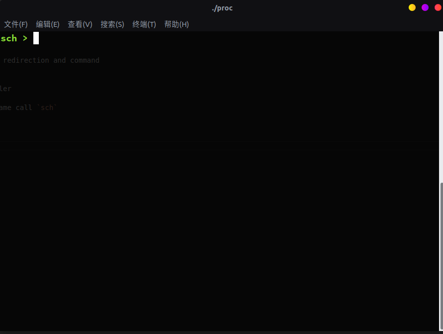
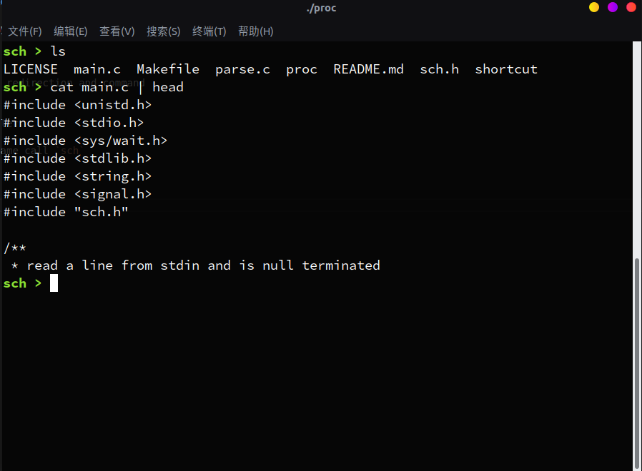
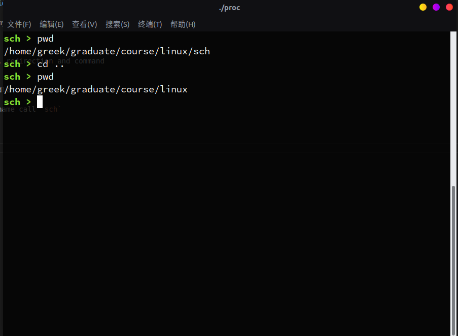
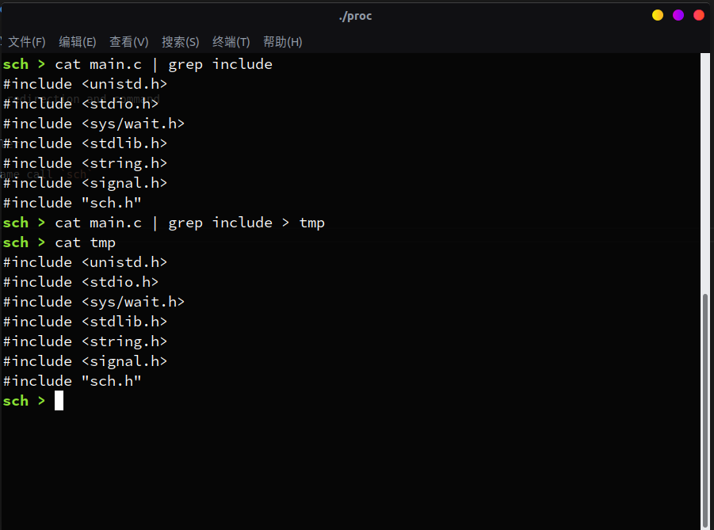
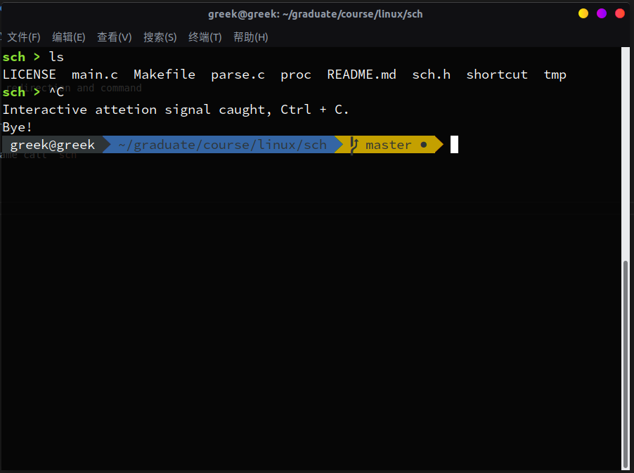

# sch

### Description

This lab is my linux operating system analysis course third experiment. It requires us to implment a mini shell.

### Features

- parse pipe, redirection and command
- pipe
- redirecton
- signal handler

> The shell name call `sch`

### Shortcut

